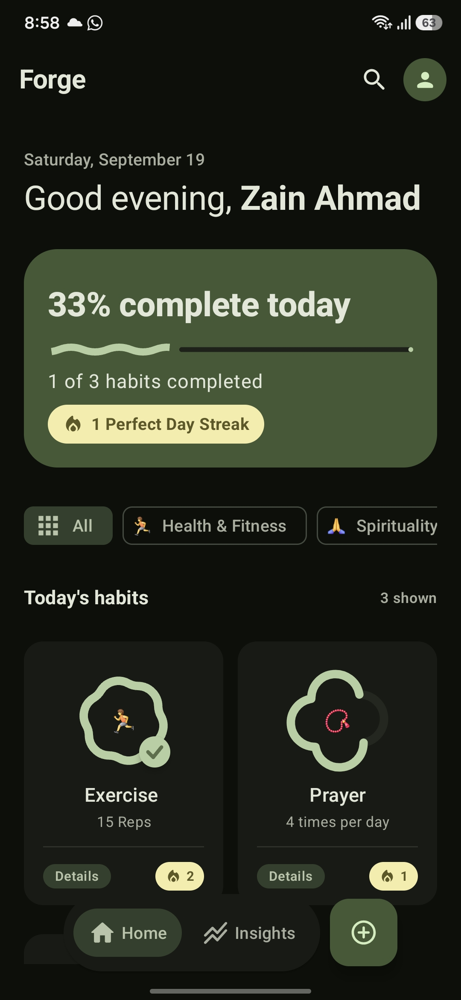
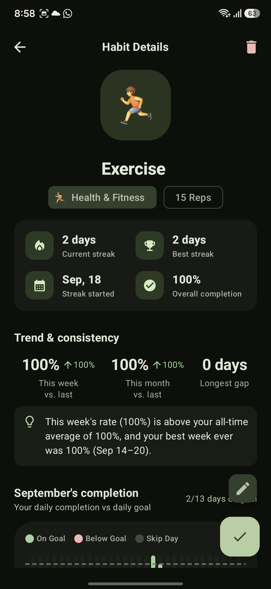
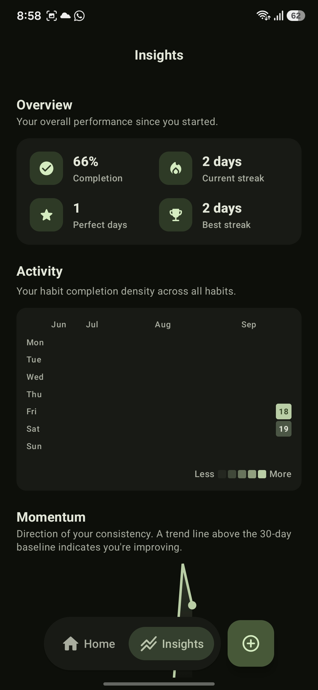
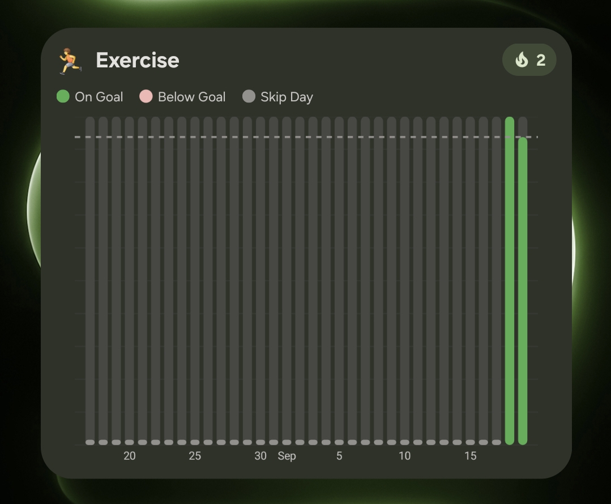
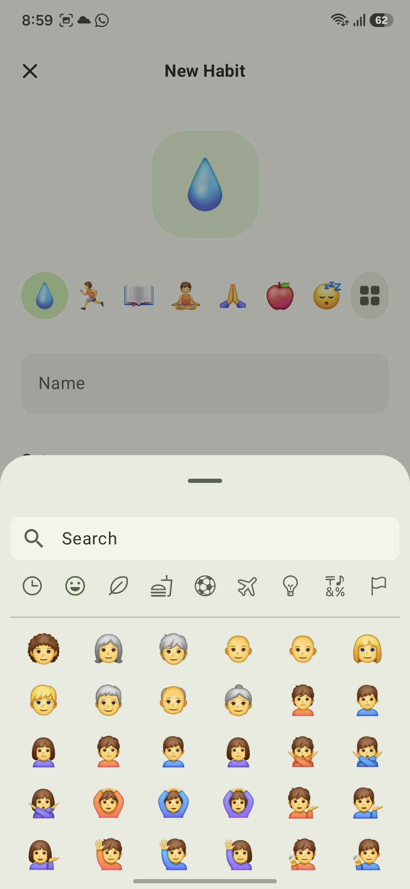
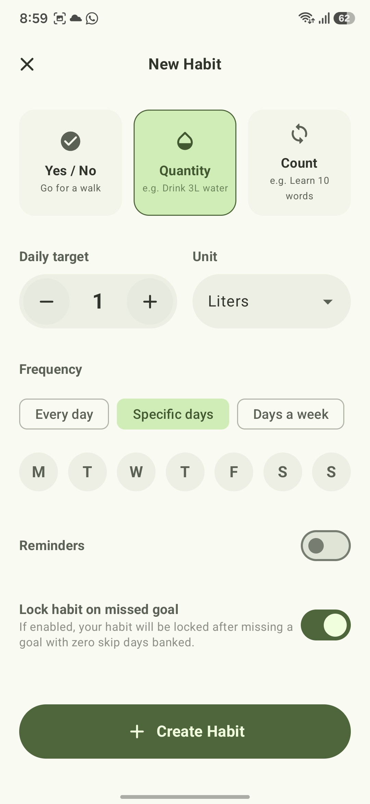

# Forge 🧘🔥

**Forge** is a high-accountability habit tracker built for those who want to turn self-discipline into a game. Inspired by **rogue-like mechanics**, Forge doesn't just track your progress—it enforces it. If you slip up without a safety net, your habit gets "locked," requiring a consistent streak to earn your way back.

Built entirely with **Jetpack Compose** and **Material 3**, Forge offers a beautiful, native Android experience that respects your privacy by keeping everything strictly on-device.

---

## 🚀 Unique Features

### 💀 Rogue-like Accountability (Locking)
Unlike other trackers that just show a red dot, Forge has consequences.
*   **Hardcore Mode**: Enable "Lock habit on missed goal". If you miss a scheduled day and have no "Skip Days" banked, the habit **locks**.
*   **The Redemption Arc**: Once a habit is locked, you cannot log progress. You must maintain a **30-day "Perfect Day" streak** across other habits to earn a Skip Day, which can then be used to unlock the failed habit.
*   **Skip Days**: Earned through consistency, these act as your "extra lives."

### 🎨 Modern Material 3 Design
Forge is a showcase of modern Android UI:
*   **Expressive UI**: Uses the latest Material 3 Expressive APIs for fluid, bouncy, and responsive components.
*   **Dynamic Theming**: Full support for Light and Dark modes with a deep, focused aesthetic.
*   **Adaptive Layouts**: Designed to look great on phones, with dedicated Home Screen widgets.

### 📊 Deep Insights & Trends
Understand your behavior with rich data visualizations:
*   **Habit Heatmaps**: GitHub-style activity grids to visualize long-term consistency.
*   **Momentum Tracking**: A trend line that compares your 7-day performance against your 30-day baseline.
*   **Consistency Analysis**: AI-like insights that tell you which days you're most consistent on.
*   **Streak Distribution**: View how your habits are clustered by their current longevity.

### 🛡️ Privacy First
*   **100% On-Device**: No accounts, no cloud, no tracking. Your data is stored in a local SQLite database (Room) and never leaves your phone.
*   **Offline by Default**: Works everywhere, anytime.

---

## 📸 Screenshots

| Dashboard | Habit Details | Insights |
| :---: | :---: | :---: |
|  |  |  |

| Widgets | Emoji Picker | New Habit |
| :---: | :---: | :---: |
|  |  |  |

---

## 🛠️ Technical Stack

*   **Language**: 100% Kotlin
*   **UI**: Jetpack Compose (Material 3)
*   **Database**: Room Persistence Library
*   **Dependency Injection**: Hilt
*   **Background Tasks**: WorkManager (for reminders and streak maintenance)
*   **Widgets**: Jetpack Glance
*   **CI/CD**: GitHub Actions for automated APK releases

---

## 📦 Installation

You can download the latest APK from the [Releases](https://github.com/ZainAhmad33/Forge-Habit-Tracker/releases) page.

1.  Download the `app-release.apk`.
2.  Install it on your Android device (ensure "Install from Unknown Sources" is enabled).
3.  Start forging your new life.

---

## 📄 License

This project is licensed under the MIT License - see the [LICENSE](LICENSE) file for details.
